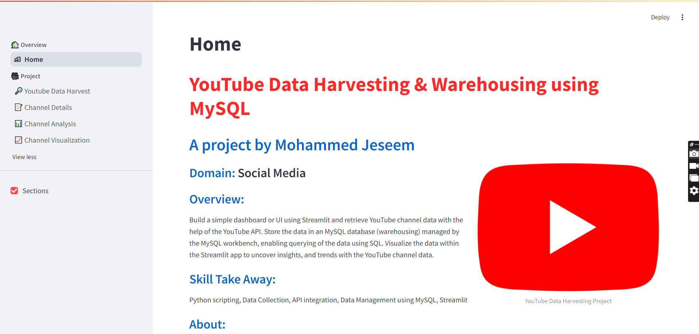
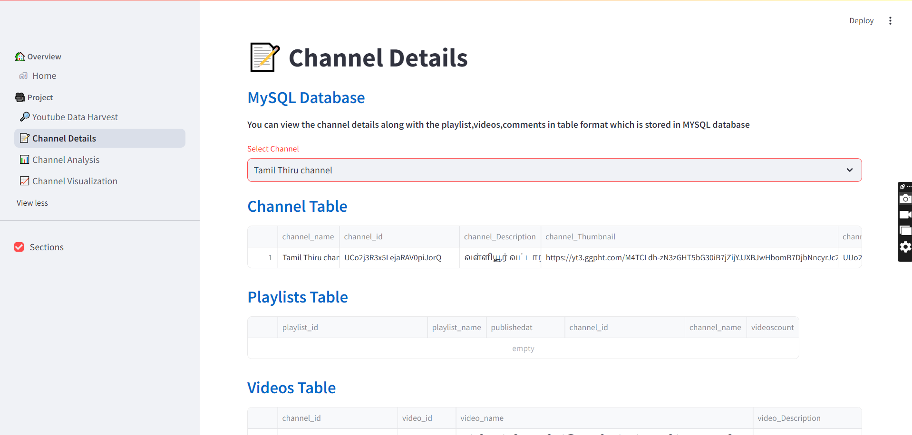
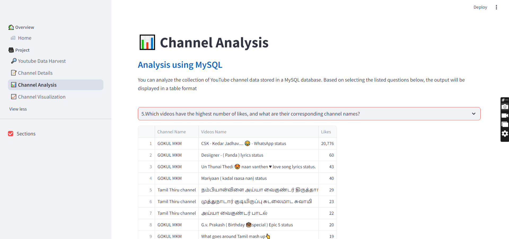
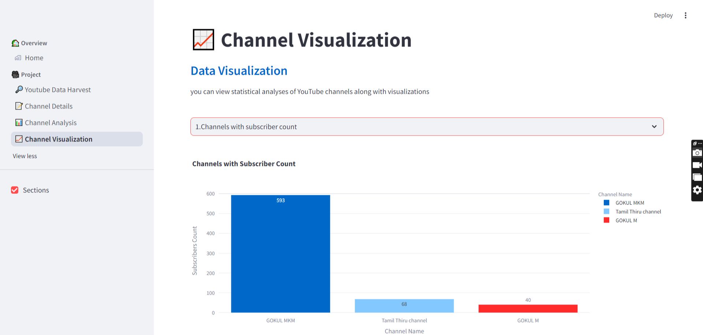

# YouTube-Data-Harvesting-and-Warehousing-using-MySQL-and-Streamlit

Welcome to the **YouTube Data Harvesting and Warehousing** project! This project involves collecting and storing YouTube data using MySQL and Streamlit. 

## 📋 Table of Contents

1. [Project Overview](#project-overview)
2. [Features](#features)
3. [Installation](#installation)
4. [Usage](#usage)
5. [Examples](#examples)
6. [Contributing](#contributing)
7. [Credits](#credits)
8. [Contact](#contact)

## 📌 Project Overview

This project is designed to extract data from YouTube, store it in a MySQL database, and visualize it using Streamlit. The main goals are to:

- Harvest data from YouTube channels and videos.
- Store and manage data efficiently using MySQL.
- Create interactive visualizations with Streamlit.

## 🚀 Features

- **Data Harvesting:** Extract channel details, playlists, videos, and comments.
- **Data Warehousing:** Store and manage YouTube data in MySQL.
- **Data Visualization:** Interactive charts and tables to analyze YouTube data using Streamlit.
- **SQL Queries:** Retrieve insights such as top-viewed videos, most liked videos, and more.

## 🛠️ Installation

### Clone the Repository

```bash
git clone https://github.com/MohammedJeseem/YouTube-Data-Harvesting-and-Warehousing-using-MySQL-and-Streamlit.git
cd YouTube-Data-Harvesting-and-Warehousing-using-MySQL-and-Streamlit
```

### Create and Activate a Virtual Environment


- #### bash
  ```
  python -m venv venv
  ```
- #### On MAC user
  ```
  source venv/bin/activate
  ```
- #### On Windows user
  ```
   venv\Scripts\activate
  ```

### Install Dependencies

```bash
pip install -r requirements.txt
```

### Set Up MySQL Database

1. **Install MySQL:** Follow [MySQL Installation Guide](https://dev.mysql.com/doc/mysql-installation-excerpt/5.7/en/).
2. **Create a Database:** Use the provided SQL schema to set up your database.

### Configure Your Environment

Update the database connection settings in src/mysql_db/mysql_connection.py.

## 💻 Usage

### Run the Streamlit Application

bash
streamlit run app.py


### Example Queries

To get insights, use the following Streamlit components:

- **Top 10 Viewed Videos:** View top 10 videos by total views.
- **Channel Subscriber Counts:** Visualize subscriber counts for each channel.
- **Average Video Duration:** Analyze average video duration per channel.

## 🎨 Examples

Here are some example screenshots of the Streamlit application:






## 🤝 Contributing

We welcome contributions! If you want to improve this project, please follow these steps:

1. Fork the repository.
2. Create a new branch (git checkout -b feature-branch).
3. Commit your changes (git commit -am 'Add new feature').
4. Push to the branch (git push origin feature-branch).
5. Create a new Pull Request.

## 🏅 Credits

- **Gokul M** - For his project reference [YouTube Data Harvesting and Warehousing using SQL and Streamlit](https://github.com/Gokul170601/YouTube-Data-Harvesting-and-Warehousing-using-SQL-and-Streamlit).
- **Profile** - [LinkedIn](www.linkedin.com/in/gokul-m-j17/)
- **Mail** - [Gmail](gokulgokul6847@gmail.com)


## 📧 Contact

For any inquiries or suggestions, please contact:

### Mohammed Jeseem .M

- **Gmail** : [mohammedjezeem786@gmail.com](mohammedjezeem786@gmail.com)
- **LinkedIn** : [https://www.linkedin.com/in/mohammed-jeseem-25894b29b/](https://www.linkedin.com/in/mohammed-jeseem-25894b29b/)


